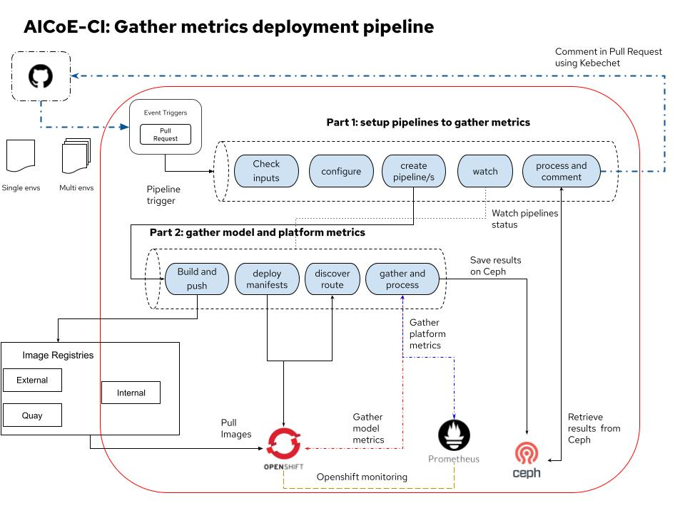
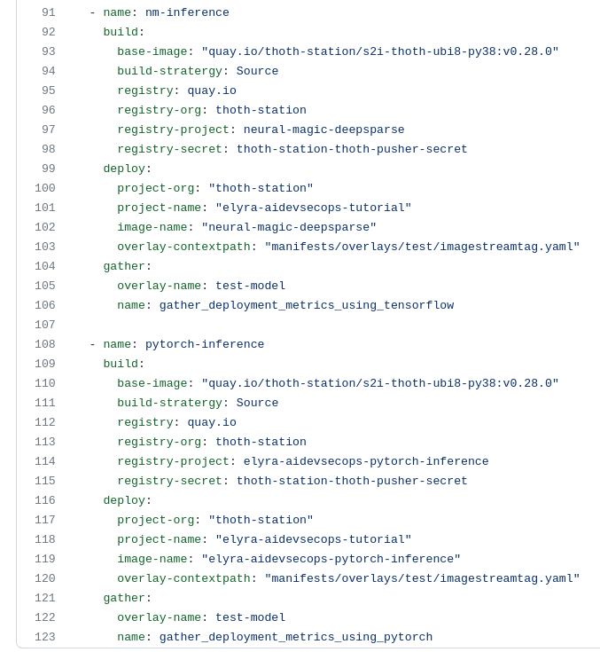

# Gather metrics deployment pipeline


Gather metrics deployment pipeline provides Data Scientists and AIDevOps Engineers with feedback about the deployed models as soon as possible in order to speed up the ML lifecycle.

In general, the application lifecycle is not static, there could be a new software stack, a new model version or a new dataset version that could modify the application. In these cases, it would be helpful to provide feedback on the impact of these changes as soon as possible. Different personas could benefit from this early feedback, for example, a Data Scientist could verify that the model created is still performing well in a production environment or an AIDevOps Engineer could receive operational information (latency, memory consumption, CPU usage) to adjust the deployment.
The feedback is provided as a report directly into a Pull Request, so that the different personas can work together and make decisions based on the metrics received. These metrics concern the type of test used to gather metrics, the model metrics collected through the test and the platform metrics gathered from pods monitoring systems (currently Prometheus).

Check this [presentation](https://github.com/thoth-station/talks/blob/master/2021-09-03-devconf-us/Feedback%20about%20deployment%20of%20an%20intelligent%20app%20-%20DevConfUS.pdf) or this [video](https://www.youtube.com/watch?v=toZzyjB0ReA) if you want to know more about the reasons behind this pipeline and how it is related to MLOps lifecycle


## Configuring gather requirements

Gather metrics deployment pipeline is part of the aicoe-ci pipelines. .aicoe.yaml is the configuration file for aicoe-ci pipelines, you can find the documentation on the different parameters [here](https://github.com/AICoE/aicoe-ci#aicoe-ci-configuration-file).

For this pipeline a new requirement section called `gather` has been added to the `.aicoe.yaml`:

```yaml
gather:
  overlay-name: test # overlay name used for running the test
  name: test_name_for_gathering_metrics
```

NOTE: _If you are using [behave](https://github.com/behave/behave) package to run a test in order to collect metrics, the `name` parameter is equivalent to the `feature` concept used in behave when running `behave -i {feature_name}`._


## Pipeline diagram and description

The pipeline diagram and behaviour can be seen in the following image:



The pipeline is triggered when a new Pull Request is opened on the users repo. To be more precise this particular pipeline is made of 1 + N pipelines, where N is the number of ML models to be deployed.

The `main pipeline` will perform the following steps: 
- check inputs from `.aicoe.yaml` to verify deployments exist;
- configure all parameters for the following task; 
- schedule `N pipelineruns`, where `N` is the number of deployments. 



- watch the N pipelines monitoring status and wait until those will finish (Failed or Succeeded). 
- once the N pipelines finishes, the last task will collect the metrics gathered, post process them and comment on the Pull Request initially opened.

Each of the `N pipelines` will perform the following steps:

- build the image and push to a registry (quay, internal or external);
- customize manifests for deployment, service and route and apply them to the cluster;
- discover the route once the application is up and running;
- run the test and collect application metrics and store them on Ceph; once the test is concluded, gather platform metrics from Prometheus and store them together with the application ones on Ceph.

NOTE: _Currently AICoE CI uses default credentials to store and retrieve data from Ceph bucket._

NOTE: _Gathering of platform metrics from AICoE CI requires access to Prometheus endpoint._